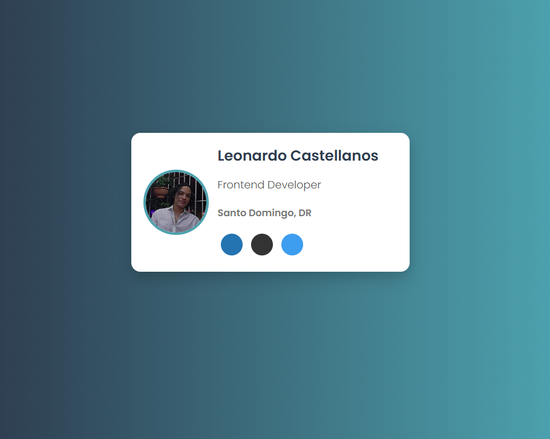

# 💳 Business Card - Digital Presentation Card

A minimalist and modern digital business card built with HTML and CSS.



---

## 🚀 Technologies Used
- HTML5
- CSS3
- Font Awesome (for social media icons)

---

## 🛠️ How to Run the Project
1. **Clone this repository**  
   ```bash
   git clone https://github.com/yourusername/business-card.git
2. **Open the BusinessCard.html file in your browser**

## 🎨 Customization   

You can easily update the information in index.html, such as your name, picture, and social media links:
<h3>Leonardo Castellanos</h3>
<p class="role">Frontend Developer</p>
<h4>Santo Domingo, DR</h4>

## 🤝 Contributing
1. **Fork the repository**  
2. **Create a branch for your improvement**
3. **Submit a pull request 🚀**

## 🤝 Contributing
If you have any questions or suggestions, feel free to contact me:
- 📧 Email: castellanosleonardo063@gmail.com/castellanosleonardo063@outlook.com
- 💼 LinkedIn: [linkedin.com/in/yourusername](https://www.linkedin.com/in/leonardo-castellanos-rivera/)

